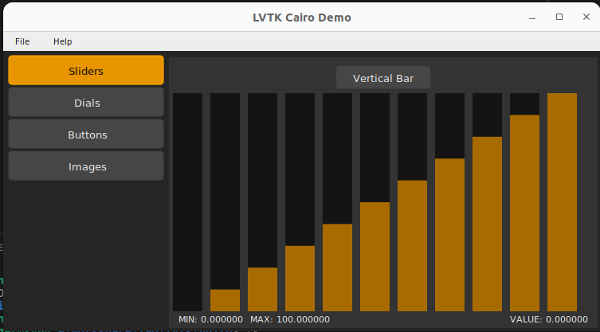
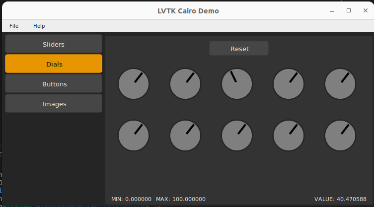
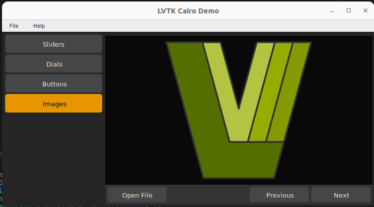

[](https://api.reuse.software/info/github.com/lvtk/lui)

# Lui

Minimal C++ Gui library with Lua bindings and console. Write your LV2 plugins and gui's in C++.  The Widgets library can be used in any project, it is not directly tied to LV2 UI.

**Heavy Development:** API's will break from time to time until the core system is ready. Plugin/UI templates are largely unchanged, but could radically change in terms of API.  

## Minimal by Design

Lui is intended to be used as a subproject by plugin developers.
## Widgets

| Widget            | Status  | Purpose              |
|-------------------|---------|----------------------|
| `lui.Widget`     | Working | Base for all widgets |
| `lui.Button`     | Close   | Base for most button types |
| `lui.TextButton` | Close   | A regular button that shows text |
| `lui.Label`      | -       | A text display Widget |
| `lui.Entry`      | Started | A basic single-line text entry |
| `lui.Ranged`     | Working | Base for Widgets with a ralue range.
| `lui.Slider`     | Close   | A basic single-value slider control |
| `lui.Dial`       | Started | A basic single-value Dial (or Knob) control |
| `lui.Embed`      | Started | Embed OS Native Windows/Views |

**Status Legend**

* **Finished** And ready to go.
* **Working** but not finished in terms of fine details and final type names and signatures.
* **Close** to working, functionality partially implemented.
* **Started** some RND, highly experimental.

## Building

To build and install, run
```
$ meson setup build
$ ninja -C build
$ ninja -C test
$ ninja install # optional
```

For MSVC on Windows, use:
```
meson setup build
meson compile -C build
meson test -C build
```

## Widgets Demo

### Linux & Windows
Go to the build directory and run it:
```
cd build
./lui-demo
```

### macOS
Double-clickable Mac apps can be found somewhere in the build directory. The following command will list them all out.
```bash
# From the source top dir.
find build -name "LUI*.app"
```

### Screenshots




## ISC License

```
Permission to use, copy, modify, and/or distribute this software for any
purpose with or without fee is hereby granted, provided that the above
copyright notice and this permission notice appear in all copies.

THE SOFTWARE IS PROVIDED "AS IS" AND THE AUTHOR DISCLAIMS ALL WARRANTIES
WITH REGARD TO THIS SOFTWARE INCLUDING ALL IMPLIED WARRANTIES OF
MERCHANTABILITY AND FITNESS. IN NO EVENT SHALL THE AUTHOR BE LIABLE FOR
ANY SPECIAL, DIRECT, INDIRECT, OR CONSEQUENTIAL DAMAGES OR ANY DAMAGES
WHATSOEVER RESULTING FROM LOSS OF USE, DATA OR PROFITS, WHETHER IN AN
ACTION OF CONTRACT, NEGLIGENCE OR OTHER TORTIOUS ACTION, ARISING OUT OF
OR IN CONNECTION WITH THE USE OR PERFORMANCE OF THIS SOFTWARE.
```

## 3rd Party Code

Graphics/UI/Hosting classes utilize these libraries internally:

| What         | For?              | License |
|--------------|-------------------|---------|
| Cairo        | Graphics backend  | [MPL-1.1](https://www.mozilla.org/en-US/MPL/1.1/annotated/) |
| STB Image    | Images            | [MIT](LICENSES/MIT.txt) |
| STB Truetype | Font Loading      | [MIT](LICENSES/MIT.txt) |
| Roboto       | Built-in font     | [Apache-2.0](LICENSES/Apache-2.0.txt) |
| Lua          | Lua Bindings      | [MIT](LICENSES/MIT.txt) |
| Sol2         | Lua Bindings      | [MIT](LICENSES/MIT.txt) |
| Boost        | Tests/Signals     | [BSL-1.0](https://www.boost.org/LICENSE_1_0.txt) |

## Issue Tracking

Please report bugs and feature requests on [GitHub](https://github.com/lvtk/lvtk/issues) or [GitLab](https://gitlab.com/lvtk/lvtk/-/issues). 
